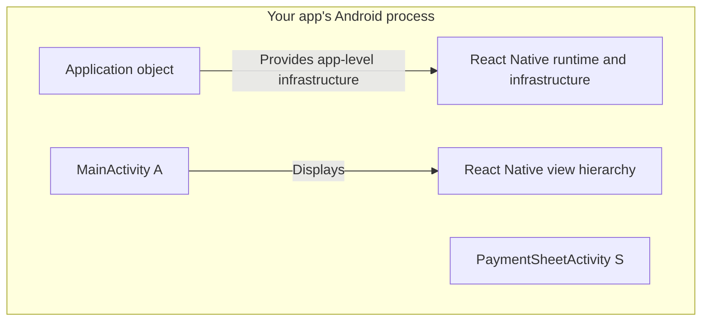
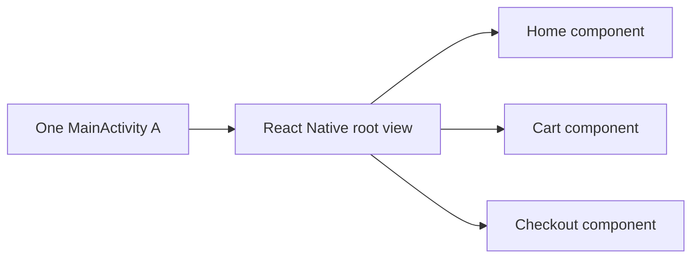
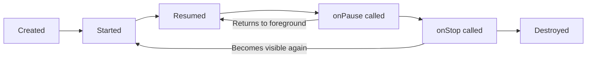

# Module 1: Android foundations

[Course index](README.md) · [Next: React Native architecture](02-react-native-architecture.md)

## Learning goals

By the end of this module, you should be able to distinguish the app process from an Activity, and explain why a React navigation screen is not necessarily another Android Activity.

## A running app contains more than a screen

An **Android process** is the operating-system container holding the app's memory and threads. The code running inside it can include JavaScript, Kotlin, Java, and native C++ code.

An **Application object** represents application-level Android state. In a typical React Native app, application-level infrastructure provides access to the React Native host. This object is different from the app's Activity.

An **Activity** is an Android component responsible for a window and its lifecycle. Calling it a screen is a useful first approximation, but there can be many views and many React navigation screens within one Activity.

A **view** is a UI element or container: a button, text field, list, or hierarchy of other views.

A and S are both part of your app. Stripe's Activity does not mean that another installed Stripe application has opened.

## React navigation usually changes views

Consider a merchant app with Home, Cart, and Checkout screens. A typical React Native navigation setup can display all three within the same `MainActivity`.

Moving from Cart to Checkout does not inherently create a new Activity, a new JavaScript runtime, or a new native-module instance. An app can have a different architecture, but the word “screen” alone does not tell us its Activity structure.

## An Activity has a lifecycle

Android calls methods on an Activity as it is created, becomes interactive, loses focus, and is destroyed.

| Event       | Meaning for this discussion                                             |
| ----------- | ----------------------------------------------------------------------- |
| `onCreate`  | A new Activity instance is being initialized.                           |
| `onStart`   | It becomes visible.                                                     |
| `onResume`  | It becomes the interactive Activity in the ordinary single-window case. |
| `onPause`   | It loses that interactive position but may remain visible.              |
| `onStop`    | It is no longer visible.                                                |
| `onDestroy` | That Activity instance's lifecycle ends.                                |

“Paused” and “stopped” describe lifecycle transitions here. They are not additional enum values named `PAUSED` and `STOPPED` in AndroidX `Lifecycle.State`.

This is a simplified lifecycle diagram. The useful distinction is that **pause is temporary, while destruction ends the lifetime of that Activity instance**.

Destruction does not make all references to the Activity vanish from memory. Another object can still hold a reference to a destroyed Activity. That reference does not make it a valid host for new UI. This is one way stale native launchers can become a problem.

## A checkout example

Before payment, A displays the merchant's React checkout screen. Opening ordinary PaymentSheet launches another Activity, S. A normally pauses while S is interactive. Depending on window visibility, A may also stop.

After S closes, the same A can resume. There is no need to create a new A for that normal sequence.

| Action                                  | Does it inherently replace A? |
| --------------------------------------- | ----------------------------- |
| Navigate between React components       | No                            |
| Open native PaymentSheet                | No                            |
| Close native PaymentSheet               | No                            |
| Destroy A and create a replacement host | Yes                           |

To investigate a lifecycle bug, name the specific object and event: “Activity A was destroyed” is much more informative than “the screen went away.”

Continue with [Module 2](02-react-native-architecture.md) to see why the JavaScript runtime can have a different lifetime from A.
