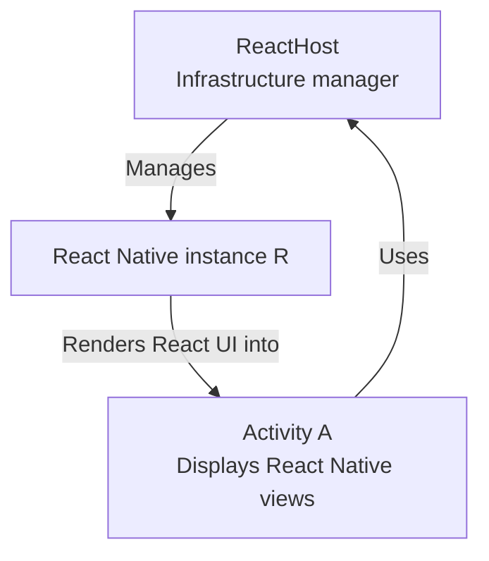
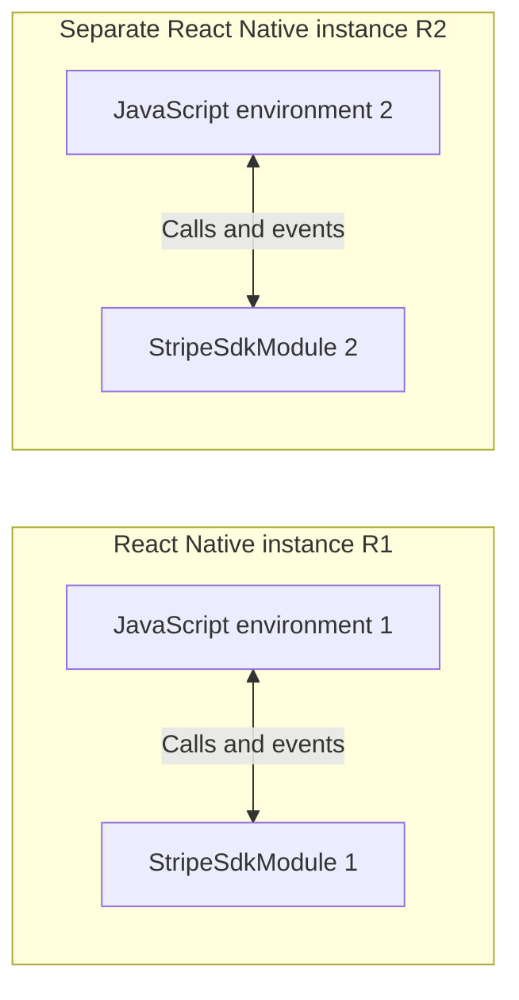

# Module 2: React Native architecture

[Previous: Android foundations](01-android-foundations.md) · [Course index](README.md) · [Next: Stripe's layers](03-stripe-layers.md)

## Learning goals

Locate the JavaScript runtime and native modules. Distinguish `ReactHost` from the Activity hosting React views. Understand the scope of `currentActivity`.

## The two meanings of host

The phrase “React host” is easy to misuse. We will use precise names:

| Term                        | Meaning                                                                                           |
| --------------------------- | ------------------------------------------------------------------------------------------------- |
| **`ReactHost`**             | A React Native infrastructure object that manages a React Native instance. It is not an Activity. |
| **React host Activity**     | The Android Activity displaying React Native views. This is A.                                    |
| **React Native instance R** | The JavaScript runtime and the associated native infrastructure for that instance.                |

This guide uses the newer architecture's `ReactHost` terminology. Older architecture code uses `ReactNativeHost` and `ReactInstanceManager` for related responsibilities.



The JavaScript runtime is not simply an object inside A that must disappear when A is destroyed. An integration can keep R alive and attach a replacement Activity. It can also explicitly destroy or reload R. Those are different lifecycle operations.

## Where JavaScript executes

The JavaScript engine, usually Hermes, executes both your application's JavaScript and the JavaScript portion of the Stripe React Native package.

That code has several jobs:

- Describe UI using React components.
- Invoke native SDK methods through React Native's module system.
- Perform application logic, such as calling your server when payment confirmation needs an intent.

React renders native views into A, but execution of JavaScript is not the same thing as the lifecycle of those views.

A component unmounting does not, by itself, destroy the JavaScript runtime or automatically cancel every network request its code started. Applications can explicitly arrange cleanup and cancellation.

## The React context and native modules

`ReactApplicationContext` is the native-side context used by React Native modules. It wraps Android application context and provides connections to React Native infrastructure.

Despite its name, it should not be interpreted as one shared React context for every runtime in the Android process.

`StripeSdkModule` is a native module associated with a particular React Native instance. JavaScript in that instance calls its methods; its events return to that instance's JavaScript environment.



These module instances and JavaScript listener registrations are separate. A native SDK may independently have process-wide state; that is a different ownership boundary.

We sometimes call JS/native communication a “bridge” in this guide. That means the boundary between JavaScript and native code. It does not imply that every call uses the legacy React Native serialized bridge; newer architecture machinery uses TurboModules and JSI.

## What `currentActivity` means

For this discussion, `ReactApplicationContext.currentActivity` identifies the Activity attached to the React context, or can be null when no Activity is attached.

It is **not a universal Android pointer to the topmost visible Activity**.

When A presents Stripe's S:

```text
Interactive native Activity: S
React context's currentActivity: A
```

Stripe's Activity does not become the React host merely by appearing above it. React Native's `onHostPause()` retains the existing Activity reference. A host resume or attachment operation can update that reference to another React host.

## Threads and waiting

Activity lifecycle and UI work involve Android's main thread. JavaScript runs through its own execution machinery. Network work is asynchronous. These are related systems, but none of their states should be substituted for another's.

For example, `await fetch(...)` lets the JavaScript function wait for a response without freezing the whole app. Likewise, a suspended Kotlin coroutine need not block Android's UI thread.

An Activity being paused does not mean the JavaScript engine has been destroyed. Background scheduling and timer policies still matter; [Module 4](04-deferred-checkout.md) explains how the Stripe wrapper handles them during checkout.

## Source references

- [React context Activity attachment and lifecycle](https://github.com/facebook/react-native/blob/v0.81.5/packages/react-native/ReactAndroid/src/main/java/com/facebook/react/bridge/ReactContext.java)
- [`ReactHostImpl` host lifecycle handling](https://github.com/facebook/react-native/blob/v0.81.5/packages/react-native/ReactAndroid/src/main/java/com/facebook/react/runtime/ReactHostImpl.kt)
- [React instance construction and native-module infrastructure](https://github.com/facebook/react-native/blob/v0.81.5/packages/react-native/ReactAndroid/src/main/java/com/facebook/react/runtime/ReactInstance.kt)
