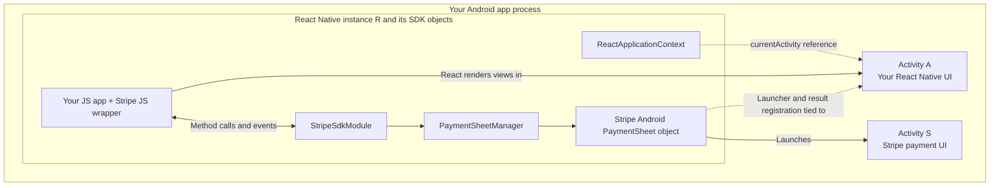

# Module 3: Stripe's layers

[Previous: React Native architecture](02-react-native-architecture.md) · [Course index](README.md) · [Next: A deferred checkout](04-deferred-checkout.md)

## Learning goals

Identify which Stripe components are JavaScript, which are native objects, and which actually display a window. Trace the route from a public JS method to native UI.

## Five pieces with similar names

| Piece                         | Language or environment                | Responsibility                                               | An Activity? |
| ----------------------------- | -------------------------------------- | ------------------------------------------------------------ | ------------ |
| Stripe JS wrapper             | JavaScript/TypeScript                  | Exposes public methods and handles native events             | No           |
| `StripeSdkModule`             | Kotlin, registered with React Native   | Receives JS method calls and sends events back               | No           |
| `PaymentSheetManager`         | Kotlin in the RN SDK                   | Holds configuration, native SDK objects, and pending results | No           |
| Stripe Android `PaymentSheet` | Native SDK object                      | Configures and launches a payment flow                       | No           |
| `PaymentSheetActivity`        | Android Activity implemented by Stripe | Displays the ordinary native PaymentSheet UI                 | **Yes**      |

Your own JavaScript checkout code sits above the JS wrapper. Your backend server sits outside the Android app process.

## Calls, references, and screens



Arrows in this diagram show calls or references. The diagram is not a claim that every object has the same lifetime as the box containing it.

The `PaymentSheet` object is the controller you call. `PaymentSheetActivity` is the UI it launches. Creating the controller and presenting its UI are separate actions.

Similarly, `PaymentSheetManager` is an adapter/state holder, not a screen. It has cleanup methods, but Android does not give it an Activity lifecycle automatically. Our code must connect its cleanup to the right owner.

## Why the host Activity matters to the native SDK

The wrapper constructs native PaymentSheet using a host Activity. That lets the SDK establish the Android launch and result-delivery machinery needed by the payment flow.

The host is A, even though the payment UI will be displayed in S.

If a controller or launcher remains associated with a destroyed A, finding a new B through the React context does not automatically rebuild that controller. This is the lifetime mismatch addressed by the original Activity-ownership PR.

## How native code calls your JavaScript handler

In this implementation, Kotlin emits a named React Native event such as `onConfirmHandlerCallback`. The JS wrapper has installed a listener that invokes the merchant's `confirmHandler`.

```text
Native SDK needs an intent
    → PaymentSheetManager emits an event through StripeSdkModule
    → Stripe's JS listener receives it
    → The listener calls your confirmHandler
```

Returning the answer is another JS-to-native call. This is an asynchronous exchange; Kotlin is not directly invoking an ordinary Kotlin function pointer to your JavaScript code.

## Other payment interfaces

- With **`customFlow: true`**, the wrapper uses `PaymentSheet.FlowController`, allowing your app to separate payment-option selection from final confirmation. Native UI can include `PaymentOptionsActivity`. The ordinary PaymentSheet timeline in the next module should not be assumed to describe every custom-flow step.
- The **Embedded Payment Element** renders native payment UI inside a React Native view. Its React Native implementation also uses deferred-intent callback entry points, which is why request-correlation changes involve it.
- The native SDK has its own callback-registration machinery. A collision there is distinct from selecting the wrong JavaScript handler or routing a JS response to the wrong pending request.

## Source references

- [Native module](https://github.com/stripe/stripe-react-native/blob/21feb807/android/src/main/java/com/reactnativestripesdk/StripeSdkModule.kt)
- [PaymentSheet manager](https://github.com/stripe/stripe-react-native/blob/21feb807/android/src/main/java/com/reactnativestripesdk/PaymentSheetManager.kt)
- [Native-to-JS event adapter](https://github.com/stripe/stripe-react-native/blob/21feb807/android/src/main/java/com/reactnativestripesdk/EventEmitterCompat.kt)
- [JavaScript wrapper](https://github.com/stripe/stripe-react-native/blob/21feb807/src/functions.ts)
