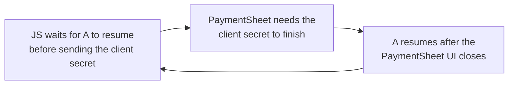

# Module 4: Follow a deferred checkout

[Previous: Stripe's layers](03-stripe-layers.md) · [Course index](README.md) · [Next: Lifecycle and ownership](05-lifecycle-and-ownership.md)

## Learning goals

Follow the round trip between JavaScript, native PaymentSheet, and your server. Distinguish the intent-creation response from the final checkout result.

## What deferred means here

In a deferred integration, the final intent client secret is supplied during confirmation rather than being supplied to PaymentSheet at initial setup.

Your app provides a handler. When the native SDK needs the intent, the JS wrapper invokes that handler. Your handler normally calls your backend, then returns a client secret or an error through a supplied callback.

The following is illustrative application code. `createIntentOnYourServer` and `showError` are application helpers, not Stripe SDK methods.

```typescript
const initialized = await initPaymentSheet({
  merchantDisplayName: 'Example Store',
  intentConfiguration: {
    mode: { amount: 1099, currencyCode: 'USD' },
    confirmHandler: async (paymentMethod, shouldSave, reply) => {
      try {
        const { clientSecret } = await createIntentOnYourServer({
          paymentMethodId: paymentMethod.id,
          shouldSave,
        });
        reply({ clientSecret });
      } catch {
        reply({
          error: {
            code: 'Failed',
            message: 'Unable to create the payment.',
          },
        });
      }
    },
  },
});

if (initialized.error) {
  showError(initialized.error);
} else {
  const result = await presentPaymentSheet();
  // Handle the final checkout result here.
}
```

There is also a confirmation-token handler variant. Its input differs, but the exchange still involves a native request, JavaScript work, and a response to native code.

## Initialization, presentation, and confirmation

```mermaid
sequenceDiagram
    participant JS as App JS + Stripe JS wrapper
    participant Adapter as Kotlin module + manager
    participant Native as Stripe native payment flow
    participant Server as Your server
    participant API as Stripe API

    JS->>Adapter: initPaymentSheet(configuration)
    Adapter->>Native: Prepare PaymentSheet using host A
    Adapter-->>JS: Initialization result

    JS->>Adapter: presentPaymentSheet()
    Adapter->>Native: Present Activity S
    Note over JS,Native: A is paused; React Native instance R remains alive

    Native->>Adapter: Customer confirms; intent is needed
    Adapter-->>JS: Confirmation-handler event
    JS->>Server: Request creation of the intent
    Server->>API: Create intent
    API-->>Server: Intent and client secret
    Server-->>JS: Client secret

    JS->>Adapter: reply with client secret
    Adapter-->>Native: Complete the pending intent request
    Native->>API: Continue payment processing
    API-->>Native: Payment outcome
    Native-->>Adapter: Final PaymentSheet result
    Adapter-->>JS: Settle presentPaymentSheet()
```

This diagram shows logical steps, not an exact promise about Activity-resume versus result-delivery ordering. A flow can also include additional authentication steps. Confirmation-token integrations can change which confirmation work happens on the server, while preserving the JS/native response exchange.

## The two different answers

The word “callback” hides an important distinction:

| Operation                                    | What its result means                                   |
| -------------------------------------------- | ------------------------------------------------------- |
| `initPaymentSheet(...)`                      | Native setup has completed or failed.                   |
| `reply({ clientSecret })` inside the handler | The native payment flow can continue using this intent. |
| `await presentPaymentSheet()`                | The payment flow completed, failed, or was canceled.    |

The reply from the intent-creation handler is needed **during** checkout. It is not the final result of checkout.

For a concrete example, imagine the server takes two seconds to create an intent. During those two seconds, S can show a loading state while A remains paused. The JavaScript function awaits the server response. The native confirmation coroutine awaits the handler's answer.

Neither wait inherently blocks Android's main thread.

## Why JavaScript can run while A is paused

The lifecycle belongs to A. It does not mean the JavaScript engine has been destroyed.

React Native does have background scheduling and timer behavior. The Stripe wrapper starts a `KeepJsAwakeTask` when presenting its UI; its stated purpose is to prevent React Native from pausing timers while Stripe UI is presented.

This does not make A resumed, create a second JavaScript runtime, or guarantee execution after process termination. It supports the normal native-UI/JavaScript cooperation within the living app.

## Why waiting for `RESUMED` can be wrong

Suppose JavaScript refuses to send the client secret until A resumes:



This can create a circular wait. The native flow needs an answer while the host is paused.

The question for this response is whether the originating operation is still valid and waiting. A blanket requirement that the React host be resumed does not answer that question.

## Source references

- [Deferred-intent example screen](https://github.com/stripe/stripe-react-native/blob/21feb807/example/src/screens/PaymentSheetDeferredIntentScreen.tsx)
- [KeepJsAwakeTask](https://github.com/stripe/stripe-react-native/blob/21feb807/android/src/main/java/com/reactnativestripesdk/utils/KeepJsAwakeTask.kt)
- [Native deferred callbacks](https://github.com/stripe/stripe-react-native/blob/21feb807/android/src/main/java/com/reactnativestripesdk/PaymentSheetManager.kt)
