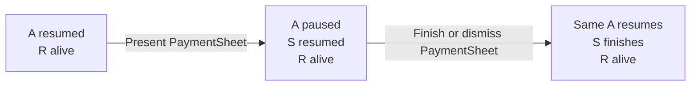
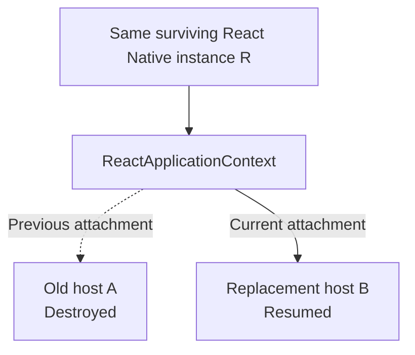
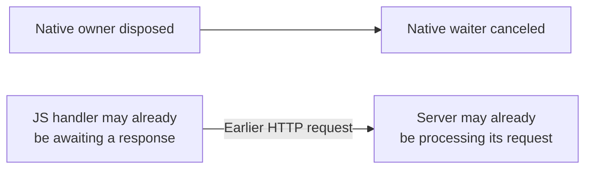

# Module 5: Lifecycle and ownership

[Previous: A deferred checkout](04-deferred-checkout.md) · [Course index](README.md) · [Next: The two PRs and their evidence](06-pr-analysis.md)

## Learning goals

Distinguish normal native presentation from replacement of the React host. Explain why canceling native work does not automatically cancel JavaScript or server work.

## The normal PaymentSheet lifecycle

In the ordinary flow, A remains the React host throughout checkout:

| Stage                      | Host A                   | PaymentSheet S | RN `currentActivity` |
| -------------------------- | ------------------------ | -------------- | -------------------- |
| Before checkout            | Resumed                  | Not open       | A                    |
| Native checkout is visible | Paused, possibly stopped | Resumed        | A                    |
| Native checkout closes     | Resumes                  | Finishes       | A                    |

The runtime can perform the necessary JavaScript work throughout this sequence. Opening S is not the host replacement discussed in the original PR.

## Host replacement is a different sequence

Now consider an integration that destroys A, creates B, and retains the same React Native instance R.

The following are different events and should be investigated separately:

- A React component unmounts.
- A pauses because native UI appears.
- A is destroyed and B replaces it within the same R.
- R is destroyed and a new React Native instance is created.
- The Android process terminates.

“The app restarted” or “the screen changed” does not tell us which of these happened.

## Multiple live Activities can share one R

An app can also start B while A remains alive in the back stack. If both use the same R, the context can point to B while A still exists.

This does not mean both are the context's current Activity. The context exposes one current reference at a time.

React Native's host lifecycle handling also distinguishes destruction of the current host from destruction of an older Activity. For example, `ReactHostImpl.onHostDestroy(activity)` checks whether that Activity is current before moving the React context through host destruction.

Consequently, a registry that owns resources for several Activities needs to observe each actual owner's lifecycle. One context-level “host destroyed” notification is not a substitute for all those individual lifetimes.

## Ownership tells us what to clean up

Suppose a manager owns a pending native callback. Disposing the manager can cancel the native coroutine waiting for the answer.

That cancellation does not automatically cross every boundary:

JavaScript cancellation needs its own mechanism. Server cancellation, if supported, needs its own mechanism too. Ending a local wait is not the same as undoing work that another system already started.

This does **not** establish that every PaymentSheet operation survives every lifecycle event. The native SDK, application, and React Native runtime can each constrain or cancel a particular sequence. A reproduction must exercise the actual integration.

## Four lifetimes worth keeping separate

| Lifetime                      | Starts with                        | Ends with                            |
| ----------------------------- | ---------------------------------- | ------------------------------------ |
| React Native instance         | Runtime creation                   | Runtime destruction/reload           |
| Host Activity instance        | Activity creation                  | That Activity's destruction          |
| PaymentSheet manager          | Wrapper creates the manager        | Wrapper disposes the manager         |
| Deferred confirmation request | Native callback requests an answer | Completion, failure, or cancellation |

A manager can serve multiple requests over time. An Activity can display many React screens. A React Native instance can, in some integrations, serve more than one host Activity over time.

## Apply this to a code review

When examining a cached object or callback, identify:

1. The object that owns it.
2. The event that ends that ownership.
3. Whether a different owner can become current before asynchronous work finishes.
4. How the response identifies the operation it belongs to.

These questions describe code responsibilities. They still need a real execution path before a conditional failure should be presented as a reproduced app bug.

## Source references

- [React context lifecycle and current Activity](https://github.com/facebook/react-native/blob/v0.81.5/packages/react-native/ReactAndroid/src/main/java/com/facebook/react/bridge/ReactContext.java)
- [ReactHostImpl current-host checks](https://github.com/facebook/react-native/blob/v0.81.5/packages/react-native/ReactAndroid/src/main/java/com/facebook/react/runtime/ReactHostImpl.kt)
