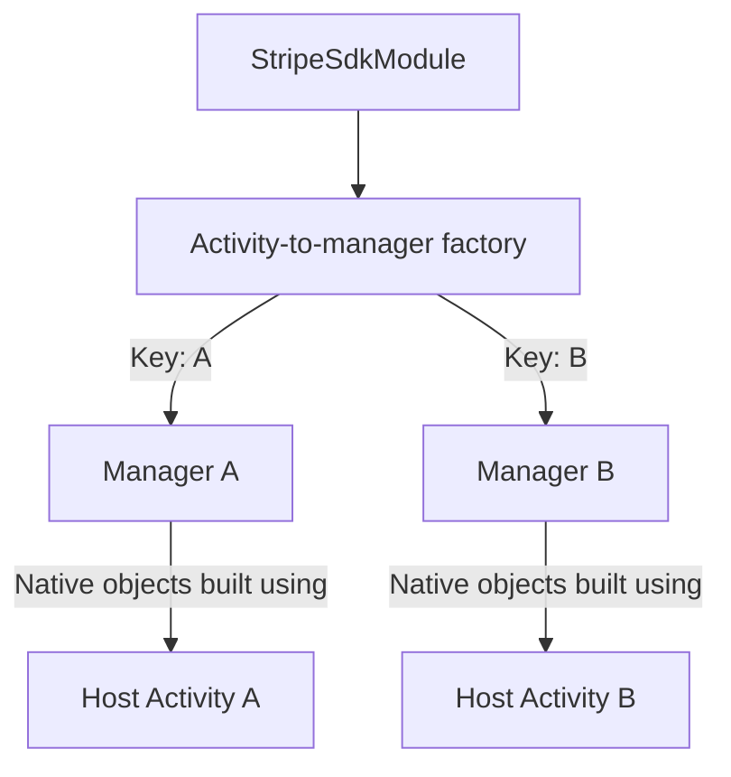
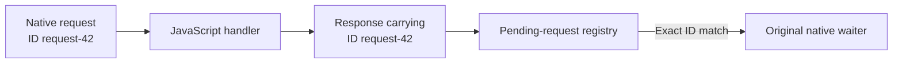

# Module 6: The two PRs and their evidence

[Previous: Lifecycle and ownership](05-lifecycle-and-ownership.md) · [Course index](README.md) · [Glossary](glossary.md)

## Learning goals

Compare Activity ownership with individual request ownership. Distinguish a demonstrated routing behavior from an end-to-end reproduction of a user-facing failure.

## Original PR #2691: Activity ownership

[PR #2691](https://github.com/stripe/stripe-react-native/pull/2691) addresses a module that outlives the Activity used to construct its native PaymentSheet objects.

The original lifetime mismatch looks like this:

```text
React Native instance R survives
    └── StripeSdkModule survives
          └── Cached manager survives
                └── Native launcher was built using A

A is destroyed; B becomes the React host.
The cached launcher does not automatically become a launcher built using B.
```

The PR introduces a factory keyed by Activity object identity:



The factory reuses a manager only for the same Activity instance. It observes each Activity's destruction and disposes that Activity's manager. Pause and stop preserve the manager because native payment UI normally pauses its React host.

Multiple managers can coexist if A and B remain alive and use the same React Native instance. The repro notes recorded two factory entries. Ordinary navigation between React components does not create those entries.

## The response-routing review comment

[Comment r4138163305](https://github.com/stripe/stripe-react-native/pull/2691#discussion_r4138163305) questions the response handler that selects a PaymentSheet manager when JavaScript returns an intent result.

Conceptually, the reviewed code does this:

```kotlin
// Simplified: when JavaScript returns a result.
val activity = reactApplicationContext.currentActivity
val manager = factory.get(activity)
manager.paymentSheetIntentCreationCallback.complete(result)
```

The Activity-keyed lookup is correct for the reference supplied to it. Multiple entries do not, by themselves, cause a collision.

The conditional concern is that the reference is obtained **when the response arrives**, rather than retained as the identity of the operation that requested the response.

If A remains the host throughout normal checkout, this particular A-to-B problem does not occur.

## Draft PR #2701: request ownership

[PR #2701](https://github.com/stripe/stripe-react-native/pull/2701) registers individual pending intent requests using unique request IDs.



The JS wrapper captures the ID in the response callback supplied to the merchant. The merchant still calls the same public callback with a client secret or error. The wrapper attaches the internal ID.

The registry removes entries after completion or cancellation. A reply for a removed or unknown entry cannot complete a different entry. PaymentSheet and embedded consumers share this response-routing mechanism within a particular `StripeSdkModule` instance.

| Aspect              | #2691                                             | #2701                                    |
| ------------------- | ------------------------------------------------- | ---------------------------------------- |
| Key                 | Host Activity identity                            | Individual request ID                    |
| Stored value        | PaymentSheet manager                              | Pending native response                  |
| Intended lifetime   | Activity ownership                                | One asynchronous exchange                |
| Main responsibility | Use and dispose the correct host's native objects | Complete the originating pending request |

**#2701 alone still uses one cached PaymentSheet manager per module.** It does not introduce the per-Activity factory or independently subscribe that manager to Activity destruction. The original PR supplies that Activity-to-manager lifecycle connection.

## Native callback collisions are another issue

[Comment r4138152971](https://github.com/stripe/stripe-react-native/pull/2691#discussion_r4138152971) raises the broader concern of multiple native instances colliding.

The repro notes described a native callback-registry failure on Stripe Android 23.20.0: one Activity's cleanup removed a callback entry used by another. The linked [native fix](https://github.com/stripe/stripe-android/commit/9198427a43d4e163c15482325347124fa50e2978) changed ordinary PaymentSheet callback ownership and is included in 23.21.0. That should not be generalized into a claim that every native controller registry is isolated; FlowController's Activity builder was a separate remaining concern in the investigation.

The native SDK registry, the JS handler subscription, and #2701's pending-response registry are different mechanisms. #2701 addresses the response-routing concern. It does not fix the native registry or scope JavaScript handler selection to individual initializations.

## What the diagnostic actually established

A temporary Robolectric diagnostic on the pre-fix #2691 implementation:

1. Constructed real module and manager objects.
2. Used a mocked React context and factory to make B current and return B's manager.
3. Injected a synthetic response designated as A's result through the module's callback method.
4. Observed that B's result holder completed while A's stayed incomplete.

It also tested the confirmation-token path and a late reply after A's manager was destroyed.

The diagnostic did not run a real PaymentSheet UI, start a real merchant server request, or drive an actual React host transition. In particular, the “A” designation came from the test setup; the old response payload itself did not identify its origin.

## Evidence boundaries

| Claim                                                                                                          | Evidence available                                       |
| -------------------------------------------------------------------------------------------------------------- | -------------------------------------------------------- |
| Native checkout normally pauses its React host                                                                 | Framework code and the wrapper's keep-JS-awake mechanism |
| A manager can retain native objects associated with a destroyed host                                           | Recorded original repro investigation                    |
| #2691's factory can hold two live-host entries                                                                 | Recorded debugger observations in the repro notes        |
| The reviewed callback method selects B when the test makes B current                                           | Deterministic diagnostic                                 |
| The request registry routes identified replies independently and ignores canceled/duplicate replies            | #2701's automated tests                                  |
| An ordinary real checkout retains A's outstanding JS response while the same R switches to B and initializes B | **Not yet reproduced**                                   |
| This late-response scenario caused the reported customer issue                                                 | **Not established**                                      |

The recorded repro notes are on the local branch `tolu/fix-paymentsheet-activity-ownership-repro`. They can be read without checking out that branch:

```sh
git show tolu/fix-paymentsheet-activity-ownership-repro:docs/issue-2563-root-cause.md
```

A stronger validation would exercise a real deferred checkout with a controlled server delay, real Activity lifecycle transitions, and evidence that the same React Native instance survives. It would then compare the observed behavior before and after the response-routing change. That validation has not been performed in this investigation.

## Source references

- [Reviewed Activity factory](https://github.com/stripe/stripe-react-native/blob/1f77e3c9/android/src/main/java/com/reactnativestripesdk/PaymentSheetManagerFactory.kt)
- [Reviewed module response routing](https://github.com/stripe/stripe-react-native/blob/1f77e3c9/android/src/main/java/com/reactnativestripesdk/StripeSdkModule.kt)
- [Proposed pending-request registry](https://github.com/stripe/stripe-react-native/blob/50c52703/android/src/main/java/com/reactnativestripesdk/IntentCreationCallbackRegistry.kt)
- [Internal JS response wrapper](https://github.com/stripe/stripe-react-native/blob/50c52703/src/internal/intentCreationCallback.ts)
