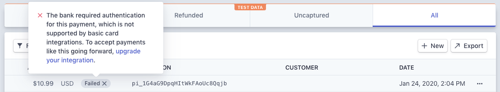

# Migrate your basic card integration

## Migrate to an integration that can handle bank requests for card authentication

If you followed the [Card payments without bank authentication](https://stripe.com/docs/payments/without-card-authentication) guide, your integration creates payments that decline when a bank asks the customer to authenticate the purchase.

If you start seeing many failed payments like the one in the Dashboard below or with an error code of `requires_action_not_handled` in the API, you should upgrade your basic integration to handle, rather than decline, these payments.



This guide will walk you through upgrading the integration you built in the previous guide to add server and client code that will prompt the customer to authenticate the payment by displaying a modal. You can see a [full sample](https://github.com/stripe-samples/accept-a-card-payment/tree/master/without-webhooks) of the final integration on GitHub.

## 1. Check if the payment requires authentication

## 2. Ask the customer to authenticate

Next, update your React Native code to tell Stripe to show a modal if the customer needs to authenticate.

Use `handleCardAction` when a PaymentIntent has a status of `requires_action`. If successful, the PaymentIntent will have a status of `requires_confirmation` and you need to confirm the PaymentIntent again on your server to finish the payment.

```tsx
function CheckoutScreen() {
  const { handleCardAction } = useStripe();

  const handleResponse = (response: { [key: string]: any }) => {
    if (response.error) {
      // handle error
    } else if (response.requiresAction) {
      const { error, paymentIntent } = await handleCardAction(
        response.clientSecret
      );

      if (error) {
        Alert.alert(`Error code: ${error.code}`, error.message);
      } else if (paymentIntent.status === PaymentIntents.Status.Succeeded) {
        // Display success message
      } else {
        // Handle other cases
      }
    } else {
      // Display success message
    }
  };
}
```

## 3. Confirm the PaymentIntent again

## 4. Test the integration
